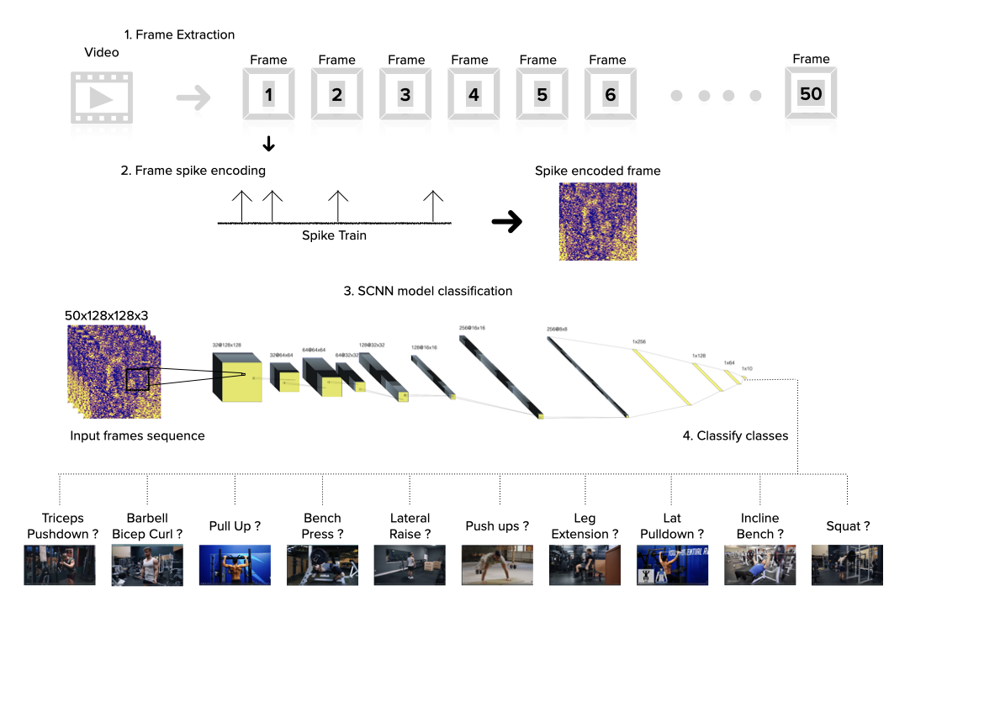

# SpikingConvolutionalNeuralNetwork
Workout/Fitness exercises classification using Spiking Convolutional Neural Network and Event-based Imaging

## Thesis Paper
[Link to Thesis](https://drive.google.com/file/d/1P8NsS93l0_TpyfWFFlPl8qo1wWvdCkCj/view?usp=sharing)

## Project Description
This project explores the use of Spiking Convolutional Neural Networks (SCNNs) for action recognition with a focus on workout and fitness exercises classification. SCNNs leverage the power of event-based imaging to efficiently process temporal data, mimicking the neural activities in the brain.



## Objectives
- Implement a SCNN model for recognizing different workout exercises.
- Utilize event-based imaging for efficient data processing.
- Evaluate the performance of the SCNN model on a dataset of workout exercises.

## Methodology
1. **Data Collection:** The dataset contain 21 different classes of exercises, we used only 10 classes. First, the dataset was preprossed into a specific dimensions and normalized. Then we extracted a sequence lenght of 50 frames per video. Finally, each frame was transformed into spike train using rate encoding technique offered by SnnTorch to represent event-based imaging.
2. **Model Architecture:** The SCNN architecture is mainly compsed of Convolutional layers, Pooiling layers, and Spiking neurons (Leaky Integrate-and-Fire Neuron).
3. **Training and Evaluation:** We splitted the spike encoded dataset into 5 KFolds and then was trained to measure the accuracy, computational load, and C02 Emission.

## Usage
1. Clone the repository:
   ```bash
   git clone https://github.com/username/SpikingConvolutionalNeuralNetwork.git
2. Open a google colab notebook, paste the repo into the notebook, and run each cell sequentially.
